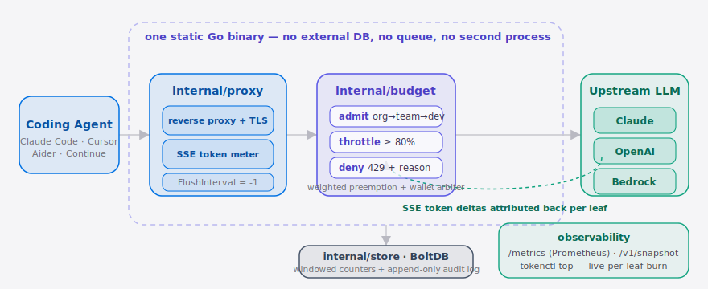

**English** | [简体中文](./README.md)

<p align="center">
  
</p>

<p align="center">
  <a href="./LICENSE"></a>
  <a href="https://github.com/SuperMarioYL/tokenctl/releases"></a>
  
  
  
  
</p>

> **tokenctl is the cgroups-style Agent budget controller that preempts and weights Coding Agent traffic for platform admins.**
>
> One YAML describes an `org → team → dev` budget tree. One static Go binary reverse-proxies Claude / OpenAI / Bedrock, attributes streamed tokens in real time, soft-throttles past 80%, hard-denies past 100% with `HTTP 429 + X-TokenCtl-Reason`, and preempts in-flight low-weight requests when a higher-weight sibling needs headroom.

## Contents

- [Why this exists](#why-this-exists)
- [Architecture](#-architecture)
- [Quickstart (10 minutes)](#quickstart-10-minutes)
- [Demo](#-demo)
- [Configuration](#configuration)
- [vs chrome-devtools-mcp](#vs-chrome-devtools-mcp)
- [Pricing](#pricing)
- [Roadmap](#roadmap)
- [License & Contributing](#license--contributing)
- [Share this](#share-this)

## Why this exists

Platform / DevEx teams keep landing on the same problem: a CFO hands one engineer the whole company's **Coding Agent** bill — Claude Code, Cursor, Aider, Continue, the whole zoo — and the tooling on the market only *sees* the spend after the fact. Helicone tallies the invoice. Portkey routes the request. LangSmith renders a dashboard. None of them stop a runaway Agent swarm at 3am.

ChromeDevTools just shipped [`chrome-devtools-mcp`](https://github.com/ChromeDevTools/chrome-devtools-mcp), giving Coding Agents direct access to a real browser debugger — a great upgrade for the **Agent**, and an even faster way to burn tokens. Open-source orgs like [HKUDS](https://github.com/HKUDS) keep publishing more capable agent runtimes. When the Coding Agent has become the team's de-facto unsupervised junior engineer, the absence of an OS-level arbiter is a hole — and that hole is exactly what tokenctl plugs.

> Anchor: Simon Willison's "\$1,500/month Claude Code cap" weeknote. tokenctl is the enforcement layer he described.

##  Architecture

<p align="center">
  <picture>
    <source media="(prefers-color-scheme: dark)" srcset="./assets/atlas-dark.svg">
    <source media="(prefers-color-scheme: light)" srcset="./assets/atlas-light.svg">
    
  </picture>
</p>

Every Coding Agent request hits one static Go binary. `internal/proxy` reverse-proxies the call and meters the streamed SSE response token-by-token; `internal/budget` runs the `org → team → dev` arbiter that admits, soft-throttles past 80%, hard-denies past 100% (`429 + X-TokenCtl-Reason`), and preempts low-weight in-flight requests when a higher-weight sibling needs headroom. Metered deltas flow back to each leaf, `internal/store` persists windowed counters plus an append-only audit log in BoltDB, and Prometheus `/metrics` + `tokenctl top` expose live burn.

One binary, three internal packages — no external DB, no message queue, no second process:

| Package | Responsibility |
| --- | --- |
| `internal/proxy` | TLS-terminating reverse proxy for Claude / OpenAI / Bedrock; parses SSE for incremental token attribution |
| `internal/budget` | Recursive `TokenGroup` tree + arbiter goroutine; owns admit / throttle / preempt decisions |
| `internal/store` | Embedded BoltDB; persists windowed `consumed` counters + append-only audit log |

## Quickstart (10 minutes)

```bash
git clone https://github.com/SuperMarioYL/tokenctl && cd tokenctl
go build -o tokenctl ./cmd/tokenctl
./tokenctl init --org acme && ./tokenctl up -c tokenctl.yaml
```

Point your Coding Agent at the proxy:

```bash
export ANTHROPIC_BASE_URL=http://localhost:8080
```

…and in another terminal:

```bash
./tokenctl top -c tokenctl.yaml
```

You'll see per-leaf tokens tick in real time as the SSE stream from Claude reaches the proxy, with every ancestor's budget counter falling alongside. Full walkthrough in [docs/quickstart.md](./docs/quickstart.md).

<details><summary>sample <code>tokenctl top</code> output</summary>

```
tokenctl top  2026-06-05T03:42:11Z  in-flight=1  throttles=0  denies=0
wallet: [██······························]  (4.2k / 20.00M = 0%)
────────────────────────────────────────────────────────────────────────────────
GROUP                             WEIGHT  USAGE       BUDGET      STATE
acme                              100     4.2k        20.00M      ok (0%)
acme.team-platform                50      4.2k        10.00M      ok (0%)
acme.team-platform.alice          50      4.2k        5.00M       ok (0%)
acme.team-product                 30      0           6.00M       ok (0%)
acme.team-research                20      0           4.00M       ok (0%)
```

</details>

##  Demo


Build the binary, generate a sample tree, start the proxy, then watch `tokenctl top` attribute every streamed token to the right `org → team → dev` leaf in real time. The recording script lives in [`docs/demo.tape`](./docs/demo.tape) and renders in CI via [`.github/workflows/demo.yml`](./.github/workflows/demo.yml).

## Configuration

Full example at [`configs/tokenctl.example.yaml`](./configs/tokenctl.example.yaml). The knobs:

| Key | Type | Default | Meaning |
| --- | --- | --- | --- |
| `listen` | string | `:8080` | Proxy listener address |
| `tls.cert_file` / `tls.key_file` | string | (empty) | TLS terminated locally; empty means plain HTTP |
| `store.path` | string | `tokenctl.db` | BoltDB file; relative paths resolve against the yaml directory |
| `metrics.listen` | string | `:9090` | Prometheus scrape endpoint |
| `wallet.budget` | object | (none) | Optional org-level cap across providers (one shared bill) |
| `providers[]` | list | required | `claude` / `openai` / `bedrock` (the last needs `region`) |
| `tree` | object | required | Root of the recursive `org → team → dev` budget tree |
| `tree.weight` | int | required | Relative share of the parent's slack |
| `tree.budget.tokens` | int | optional | Hard ceiling per window |
| `tree.budget.window` | duration | required | Go duration (`1h`, `24h`, `720h`) |
| `tree.budget.soft_throttle_at` | float ∈ (0,1] | `0.8` | Soft-throttle trigger fraction |
| `api_keys[]` | list | required | Pin inbound Bearer tokens to leaf paths |

## vs chrome-devtools-mcp

[`ChromeDevTools/chrome-devtools-mcp`](https://github.com/ChromeDevTools/chrome-devtools-mcp) makes the Coding Agent more *capable*; tokenctl makes the platform team in *control*. They sit on different layers of the same pipeline:

| Axis | chrome-devtools-mcp | tokenctl |
| --- | --- | --- |
| Layer | Agent → browser devtools | Agent → tokens / wallet |
| Shape | npm / MCP server, follows the Agent | Standalone reverse proxy, platform-side |
| Debugger reach | ✓ Far better than tokenctl | — Out of scope |
| Cross-provider wallet | — | ✓ Claude + OpenAI + Bedrock on one bill |
| Mid-stream preemption | — | ✓ Cancels low-weight in-flight calls |
| Soft-throttle + hard-deny | — | ✓ 80% FIFO queue / 100% 429 |

Honest call-out: `chrome-devtools-mcp` is materially better than tokenctl on its actual job. The two are **complementary**, not competitive — install both.

## Pricing

The OSS binary (Apache-2.0) is free forever. The **Hosted Control Plane** is for platform teams that need a procurement-friendly version:

| Tier | Fit | Price |
| --- | --- | --- |
| **OSS self-hosted** | 1–500 governed seats | Free |
| **Hosted Pro** | Series B/C, multi-region HA, SSO / SCIM, 90-day audit retention, Slack / PagerDuty alerts | **\$1,500 / mo** including 500 seats; \$3 / seat / month beyond |
| **Hosted Enterprise** | Large platform orgs, private deploy, SOC2 path | Talk to us |

Anchor: Simon Willison's \$1,500 per-developer cap — same dollar figure, but it's the *floor on the wallet*, not the per-dev ceiling.

➡ Want a hosted endpoint running in us-east-1 in 30 minutes? Mail [leo.stack@outlook.com](mailto:leo.stack@outlook.com).

## Roadmap

- [x] **m1 — `proxy_meter`**: reverse proxy + SSE incremental attribution + `/metrics` + `tokenctl top` live view
- [x] **m2 — `tree_weight`**: YAML-defined tree + soft-throttle (80%) + hard-deny (`429` + `X-TokenCtl-Reason`)
- [x] **m3 — `preempt_arb`**: in-flight preemption + cross-provider wallet arbitration (Claude + OpenAI + Bedrock on one wallet)
- [ ] **m4** — Hosted Control Plane GA (Fly.io multi-region + Stripe Billing + WorkOS SSO)
- [ ] **m5** — Web UI (read-only first; writes still go through YAML + Git)
- [ ] **m6** — Anthropic Workspaces / LangSmith billing webhook integration

## License & Contributing

Apache-2.0. See [LICENSE](./LICENSE).

File bugs and ideas at [GitHub Issues](https://github.com/SuperMarioYL/tokenctl/issues); please open one before sending a PR so we can align on direction.

After pushing the repo, set GitHub topics so the right people find it:

```bash
gh repo edit --add-topic mcp --add-topic agent --add-topic claude-code --add-topic llm-budget
```

## Share this

```
tokenctl — the Coding Agent governor your platform team can actually install.
cgroups-style hierarchical budgets, real-time SSE attribution, mid-stream
preemption. Single Go binary. Apache-2.0.
👉 https://github.com/SuperMarioYL/tokenctl
```
