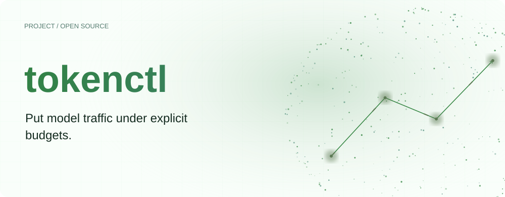
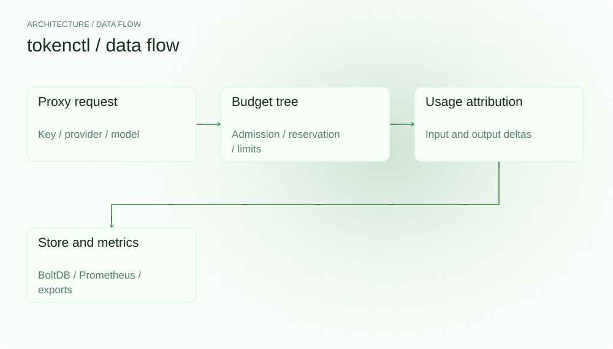
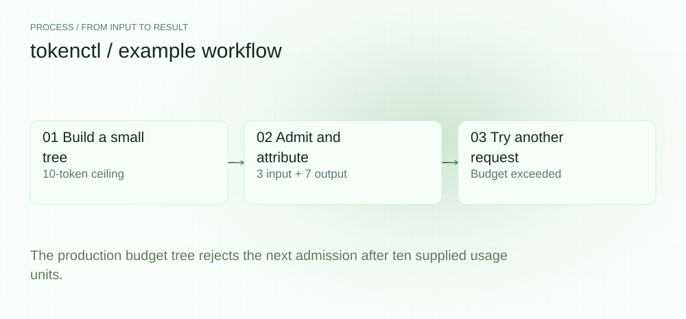
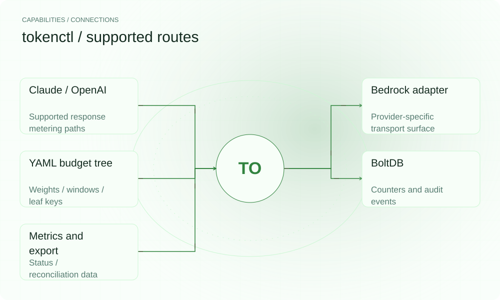

**English** | [简体中文](README.md)

<picture>
  <source media="(max-width: 640px) and (prefers-color-scheme: dark)" srcset="assets/presentation/hero-mobile-dark.svg">
  <source media="(max-width: 640px)" srcset="assets/presentation/hero-mobile-light.svg">
  <source media="(prefers-color-scheme: dark)" srcset="assets/presentation/hero-dark.svg">
  
</picture>

**Configure organization, team and developer token budgets, attribute proxy usage, control admission and expose runtime metrics.**

`v0.15.0` · `Go 1.24+` · [Apache-2.0](LICENSE)

[Website](https://tokenctl.lei6393.com) · [Demo record](docs/demo-results.json)

## Why use it

When developers share model capacity, operators need request attribution and an explicit point to reject new work. tokenctl binds inbound keys to budget-tree leaves, propagates usage to ancestors and supports a shared wallet plus model-tier limits. Budget units and cost estimates are configured separately.

## Architecture

<picture>
  <source media="(max-width: 640px) and (prefers-color-scheme: dark)" srcset="assets/presentation/architecture-mobile-dark.svg">
  <source media="(max-width: 640px)" srcset="assets/presentation/architecture-mobile-light.svg">
  <source media="(prefers-color-scheme: dark)" srcset="assets/presentation/architecture-dark.svg">
  
</picture>

Configuration builds the tree and budget grants an Admission with reserved capacity. The proxy forwards traffic and parses usage from supported protocols. AddInput/AddOutput attribute counters; BoltDB persists counters and audit events. Prometheus, top and export expose state. Preemption cancels admission context for the proxy to interrupt upstream work.

Source entry points: [cmd/tokenctl/main.go](cmd/tokenctl/main.go) · [cmd/tokenctl/export.go](cmd/tokenctl/export.go) · [internal/config/config.go](internal/config/config.go) · [internal/budget/tree.go](internal/budget/tree.go) · [internal/budget/preempt.go](internal/budget/preempt.go) · [internal/proxy/proxy.go](internal/proxy/proxy.go) · [internal/store/state.go](internal/store/state.go) · [configs/tokenctl.example.yaml](configs/tokenctl.example.yaml)

## Install

Requires Go 1.24+. The go run example creates an in-memory budget tree without starting HTTP, calling a model or writing a user ledger.

```bash
git clone https://github.com/SuperMarioYL/tokenctl.git
cd tokenctl
go build -o bin/tokenctl ./cmd/tokenctl
```

## Quickstart

Supply the production budget tree with explicit counters of 3 input and 7 output tokens, then try another admission at the 10-token ceiling. These numbers are example inputs, not measured model traffic.

```bash
go run ./examples/presentation-demo
```

Complete inputs and execution steps are included in the commands above and the [demo record](docs/demo-results.json).

## Usage

```bash
./bin/tokenctl init --org acme
./bin/tokenctl up -c tokenctl.yaml
# In another terminal:
./bin/tokenctl top -c tokenctl.yaml --once
```
Before starting, edit providers, api_keys and budgets and configure authentication accepted by the actual upstream. Clients must route traffic through the proxy; starting it alone produces no usage. Soft throttling returns 429 with Retry-After and hard denial returns budget_exceeded. An in-progress stream cannot change HTTP status after headers are sent.

## Recorded demo

<picture>
  <source media="(max-width: 640px) and (prefers-color-scheme: dark)" srcset="assets/presentation/process-mobile-dark.svg">
  <source media="(max-width: 640px)" srcset="assets/presentation/process-mobile-light.svg">
  <source media="(prefers-color-scheme: dark)" srcset="assets/presentation/process-dark.svg">
  
</picture>

### Deny admission at the ceiling

After the first request’s usage is attributed, the next admission returns budget exceeded.

```text
$ go run ./examples/presentation-demo
{
  "budget_tokens": 10,
  "group": "demo.developer",
  "next_request_denied": true,
  "reason": "tokenctl: budget exceeded",
  "supplied_input_tokens": 3,
  "supplied_output_tokens": 7
}
```

## Capabilities and integration

<picture>
  <source media="(max-width: 640px) and (prefers-color-scheme: dark)" srcset="assets/presentation/integrations-mobile-dark.svg">
  <source media="(max-width: 640px)" srcset="assets/presentation/integrations-mobile-light.svg">
  <source media="(prefers-color-scheme: dark)" srcset="assets/presentation/integrations-dark.svg">
  
</picture>

The CLI provides init/up/top/export and the service exposes Prometheus metrics and snapshots. Provider adapter code and actual cloud-account authentication are separate requirements. This example calls the budget core only, without testing the proxy or provider connectivity.


## Configuration

Concurrent admissions can exceed the configured budget because checking and reserving are separate operations. Until they are atomic, do not rely on tokenctl as a strict token cap for concurrent traffic.

See [tokenctl.example.yaml](configs/tokenctl.example.yaml). tree defines name/weight/budget/children and api_keys bind leaves; wallet supplies an aggregate ceiling. model_tiers supports model regexes, cost_multiplier and tier budgets; reset_policy supports hard/rollover/grace. pricing supplies export cost estimates. store.path is relative to the config directory; TLS, listen and metrics configure service addresses.

## Roadmap and scope

Budget trees, reservations, model tiers, reset policies, proxy metering and audit export are implemented. A hosted control plane, team SSO and automatic provider-invoice integration remain future directions.

- Metering depends on upstream protocols and usage fields. Token budgets differ from monetary costs; example counters are not invoices.
- This example does not validate SSE metering, online preemption or live-provider connectivity; each needs integration validation in its environment.

 · [Recording script](docs/demo.tape)

## License

[Apache-2.0](LICENSE)
